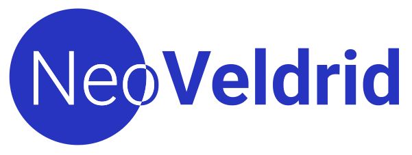

<p align="center">
  
</p>

<p align="center">
  <a href="https://github.com/jhm-ciberman/neo-veldrid/actions/workflows/ci.yml"></a>
</p>

> [!NOTE]
> NeoVeldrid 1.0.0 will be published to NuGet in the upcoming weeks. In the meantime, you can use it as a project reference.

A low-level, high-performance, cross-platform graphics library for .NET. Build 2D and 3D games, simulations, and tools with a single portable API across Vulkan, Direct3D 11, OpenGL, and OpenGL ES.

NeoVeldrid is a maintained fork of [Veldrid](https://github.com/veldrid/veldrid), with all native bindings replaced by [Silk.NET](https://github.com/dotnet/Silk.NET). The public API is fully preserved.

**[Documentation](https://jhm-ciberman.github.io/neo-veldrid/)** | **[Getting Started](https://jhm-ciberman.github.io/neo-veldrid/articles/getting-started/intro.html)** | **[API Reference](https://jhm-ciberman.github.io/neo-veldrid/api/)**


## Features

- **Multi-backend** - Write your rendering code once. It runs on Vulkan, Direct3D 11, OpenGL, and OpenGL ES without any changes.
- **Cross-platform** - Windows, Linux, and macOS from a single codebase. All native dependencies ship as NuGet packages.
- **High performance** - Thin abstraction close to the metal. Allocation-free rendering loop. Multi-threaded command recording.
- **Modern GPU features** - Programmable shaders, compute, structured buffers, array textures, multisampling, multi-target framebuffers.
- **Portable shaders** - Write GLSL once, cross-compile to all backends via SPIR-V at runtime.
- **Pure .NET** - Install a NuGet package and start coding. No native SDKs, no manual library copying, no build scripts.

## Platform Support

|               | Vulkan | D3D11 | OpenGL | OpenGL ES |
| :------------ | :----: | :---: | :----: | :-------: |
| Windows       |   ✅   |  ✅   |   ✅   |    ✅     |
| Linux         |   ✅   |  --   |   ✅   |    ✅     |
| macOS         | ✅ (1) |  --   |   ❌   |    --     |

(1) Via [MoltenVK](https://github.com/KhronosGroup/MoltenVK), bundled automatically. No setup required.

All backends pass the full GPU test suite and all 9 samples have been validated visually on Windows, Linux, and macOS.

## Quick Start

```bash
dotnet build NeoVeldrid.slnx
```

Requires .NET 10 SDK.

```bash
# Colored quad
dotnet run --project samples/GettingStarted/GettingStarted.csproj

# Full scene with shadows, reflections, and ImGui
dotnet run --project samples/NeoDemo/NeoDemo.csproj

# Force a specific backend
NEOVELDRID_BACKEND=vulkan dotnet run --project samples/NeoDemo/NeoDemo.csproj
```

See the [documentation](https://jhm-ciberman.github.io/neo-veldrid/) for tutorials, API reference, and the full [samples directory](samples/).

## Coming from Veldrid?

NeoVeldrid preserves full API compatibility. Update your NuGet packages, rename the namespace, and you're done. See the [Migration Guide](https://jhm-ciberman.github.io/neo-veldrid/articles/migration.html) for details.

## Contributing

See [CONTRIBUTING.md](CONTRIBUTING.md) for build instructions, testing guidelines, and how to submit a PR.

## Acknowledgments

NeoVeldrid exists thanks to Eric Mellino ([@mellinoe](https://github.com/mellinoe)), who designed and built the original Veldrid. The architecture, public API, and core abstractions are entirely his work. NeoVeldrid only replaces the internal binding layer - the design that makes it all possible is Eric's. His library opened the door to cross-platform graphics programming in .NET for many of us, and we're grateful for that.

## Related Projects

- [mellinoe/veldrid](https://github.com/mellinoe/veldrid) - The original Veldrid. No longer actively maintained.
- [veldrid2/veldrid2](https://github.com/veldrid2/veldrid2) - Community fork focused on bug fixes, keeping the same binding stack.
- [dotnet/Silk.NET](https://github.com/dotnet/Silk.NET) - The .NET bindings library used by this fork.
